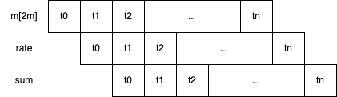
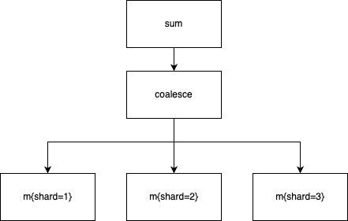

# PromQL Query Engine

A multi-threaded implementation of a PromQL Query Engine based on the [Volcano/Iterator model](https://paperhub.s3.amazonaws.com/dace52a42c07f7f8348b08dc2b186061.pdf).

The project is currently under active development.

## Roadmap

The engine intends to have full compatibility with the original engine used in Prometheus. Since implementing the full specification will take time, we aim to add support for most commonly used expressions while falling back to the original engine for operations that are not yet supported. This will allow us to have smaller and faster releases, and gather feedback on regular basis. Instructions on using the engine will be added after we have enough confidence on its correctness.

The following table shows operations which are currenly supported by the engine

| Type                   | Supported                                                           | Priority |
|------------------------|---------------------------------------------------------------------|----------|
| Rate                   | Full support                                                        |          |
| Aggregations           | Partial support (sum, max, min, avg and count)                      | Medium   |
| Aggregations over time | Partial support (sum, max, min, avg and count) _over_time           | Medium   |
| Binary expressions     | Partial support (lack of included labels in group_left/group_right) | Medium   |
| Functions              | No support                                                          | Medium   |
| Quantiles              | No support                                                          | High     |

In addition to implementing multi-threading, we would ultimately like to end up with a distributed execution model.

## Design

At the beginning of a PromQL query execution, the query engine computes a physical plan consisting of multiple independent operators, each responsible for calculating one part of the query expression.

Operators are assembled in a tree-like structure with every operator calling `Next()` on its dependants until there is no more data to be returned. The result of the `Next()` function is a *column vector* (also called a *step vector*) with elements in the vector representing samples with the same timestamp from different time series.

  

This model allows for samples from individual time series to flow one execution step at a time from the left-most operators to the one at the very right. Since most PromQL expressions are aggregations, samples are reduced in number as they are pulled by the operators on the right. Because of this, samples from original timeseries can be decoded and kept in memory in batches instead of being fully expanded.

In addition to operators that have a one-to-one mapping with PromQL constructs, the Volcano model also describes so-called Exchange operators which can be used for flow control and optimizations, such as concurrency or batched selects. An example of an *Exchange* operator is described in the [Intra-operator parallelism](#intra-operator-parallelism) section.

### Inter-operator parallelism

Since operators are independent and rely on a common interface for pulling data, they can be run in parallel to each other. As soon as one operator has processed data from an evaluation step, it can pass the result onward so that its upstream can immediately start working on it.

  

### Intra-operator parallelism

Parallelism can also be added within individual operators using a parallel coalesce exchange operator. Such exchange operators are indistinguishable from regular operators to their upstreams since they respect the same `Next()` interface.

  

### Memory management

#### Step vector allocations

One challenge with the streamed execution model is knowing how much memory to allocate in each operator for each step.

To work around this issue, operators expose a `Series()` method which returns the labels for all time series that they will ever produce (for all `Next()` calls). Operators at the very bottom of the tree, like vector and matrix selectors, have this information since they are responsible for loading data from storage. Other operators can then call `Series()` on the downstream operator and pre-compute all possible outputs.

Even though this might look like an expensive operation, its cost is identical to just one evaluation step. Knowing sizes of input and output vectors also allows us to:
* allocate memory very precisely by properly sizing vector pools (see section bellow),
* use arrays instead of maps for indexing data, leading to faster execution times due to having less allocations and using index-based lookups, and
* use tight loops in operators by eliminating conditional statements associated with maps.

#### Vector pools

Since time series are decoded one step at a time, vectors between execution execution steps can be recycled manually instead of relying on the garbage collector. Each operator has its own pool that it uses to allocate new step vectors and send results to its upstream. Whenever the upstream operator is finished with processing a step vector, it will return that vector to the pool of its downstream so that it can be reused again for subsequent steps.

#### Memory limits

There are currently no mechanisms to apply memory limits to queries within the engine. This is a highly desirable feature, and we would like to explore ways in which we can support it.

### Concurrency control

The current implementation uses goroutines very liberally which means the query will use as many cores as possible. Limiting the number of cores which a query can use is not yet implemented but we would eventually like to have support for it.

### Plan optimization

The current implementation creates a physical plan directly from the PromQL abstract syntax tree. Plan optimizations not yet implemented and would require having a logical plan as an intermediary step.
