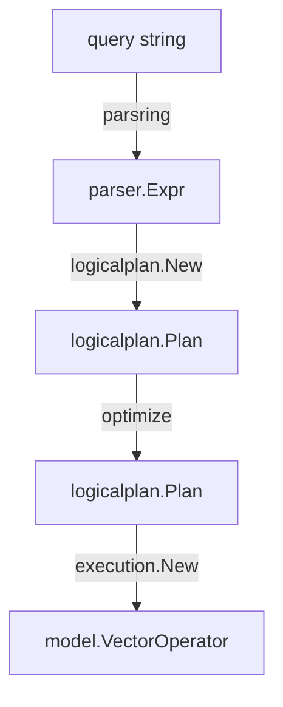
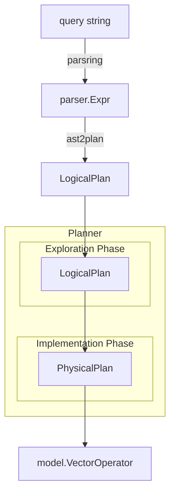
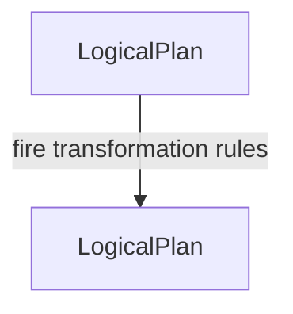
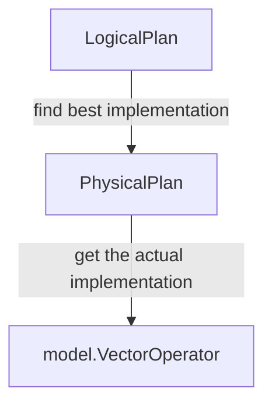

Proposal: separate between AST & execution, refactor query planner
===

## Background

Quotes from https://github.com/thanos-io/promql-engine/issues/5

```
We currently translate the AST directly to a physical plan. Having an in-between logical plan will allow us to run optimizers before the query is executed.

The logical plan would have a one to one mapping with the AST and will contain the parameters of each AST node.
Query optimizers can then transform the logical plan based on predefined heuristics. One example would be optimizing series selects in binary operations so that we do as few network calls as possible.

Finally, we would build the physical plan from the optimized logical plan instead doing it from the AST directly.
```

Here's our current query lifecycle



The `logicalplan.Plan` is just a wrapper of `parser.Expr`, and the conversion from `logicalplan.Plan` to `model.VectorOperator` is actually direct conversion from `parser.Expr` to `model.VectorOperator`.

Another point, is our optimizers are heuristic optimizers, hence it's could not optimize for some complex queries, and could not use the data statistic to perform the optimization

## Proposal

We will implement the 2-stages planner according to Volcano planner



### Exploration phase

The exploration phase, used to explore all possible transformation of the original logical plan



**Define**:
- `Group`: The `Equivalent Group`, or the `Equivalent Set`, is a group of multiple equivalent logical plans
- `GroupExpr`: representing a logical plan node (basically it's just wrap around the logical plan, with some additional information)

```go
type Group struct {
	// logical
	Equivalents map[ID]*GroupExpr // The equivalent expressions.
	ExplorationMark
}

type GroupExpr struct {
	Expr                   logicalplan.LogicalPlan // The logical plan bind to the expression.
	Children               []*Group                // The children group of the expression, noted that it must be in the same order with LogicalPlan.Children().
	AppliedTransformations utils.Set[TransformationRule]
	ExplorationMark
}
```

Here is the interface of transformation rule

```go
type TransformationRule interface {
	Match(expr *GroupExpr) bool                      // Check if the transformation can be applied to the expression
	Transform(expr *GroupExpr) *GroupExpr // Transform the expression
}
```

```go
for _, rule := range rules {
    if rule.Match(equivalentExpr) {
        if !equivalentExpr.AppliedTransformations.Contains(rule) {
            transformedExpr := rule.Transform(o.memo, equivalentExpr)
            // add new equivalent expr to group
            group.Equivalents[transformedExpr.ID] = transformedExpr
            equivalentExpr.AppliedTransformations.Add(rule)
            // reset group exploration state
            transformedExpr.SetExplore(round, false)
            group.SetExplore(round, false)
        }
    }
}
```

### Implementation phase

After exploration phase, we have the expanded logical plan (including the original plan and the transformed plans)

Then we will find the implementation which has the lowest implementation cost




The physical plan represent the actual implementation of a logical plan (the `Children` property in `PhysicalPlan` is used for cost calculation)

```go
type PhysicalPlan interface {
	SetChildren(children []PhysicalPlan) // set child implementations, also update the operator and cost.
	Children() []PhysicalPlan            // Return the saved child implementations from the last CalculateCost call.
	Operator() model.VectorOperator        // Return the saved physical operator set from the last CalculateCost.
	Cost() cost.Cost                       // Return the saved cost from the last CalculateCost call.
}
```

For each logical plan, we will have several implementations

```go
type ImplementationRule interface {
	ListImplementations(expr *GroupExpr) []physicalplan.PhysicalPlan // List all implementation for the expression
}
```

And we will find the best implementation, via simple dynamic programming

```go
var possibleImpls []physicalplan.PhysicalPlan
for _, rule := range rules {
    possibleImpls = append(possibleImpls, rule.ListImplementations(expr)...)
}
```

```go
var currentBest *memo.GroupImplementation
for _, impl := range possibleImpls {
    impl.SetChildren(childImpls)
    calculatedCost := impl.Cost()
    if groupImpl != nil {
        if costModel.IsBetter(currentBest.Cost, calculatedCost) {
            currentBest.SelectedExpr = expr
            currentBest.Implementation = impl
            currentBest.Cost = calculatedCost
        }
    } else {
        currentBest = &memo.GroupImplementation{
            SelectedExpr:   expr,
            Cost:           calculatedCost,
            Implementation: impl,
        }
    }
}
```